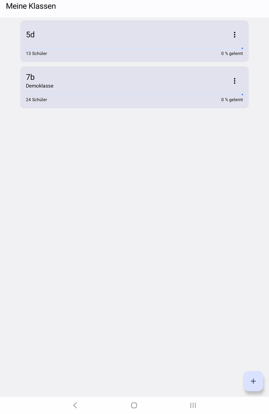
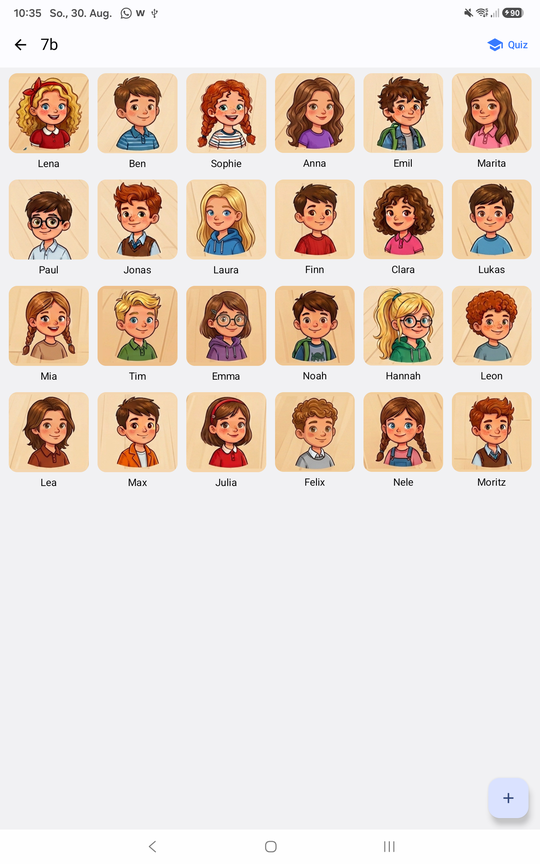
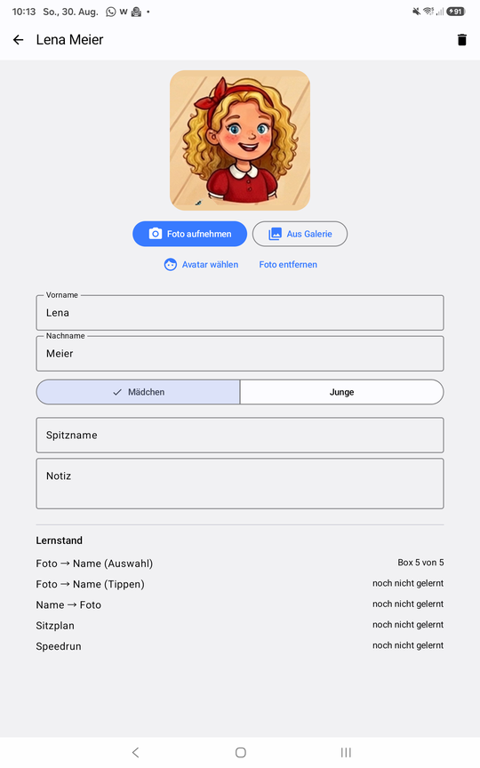
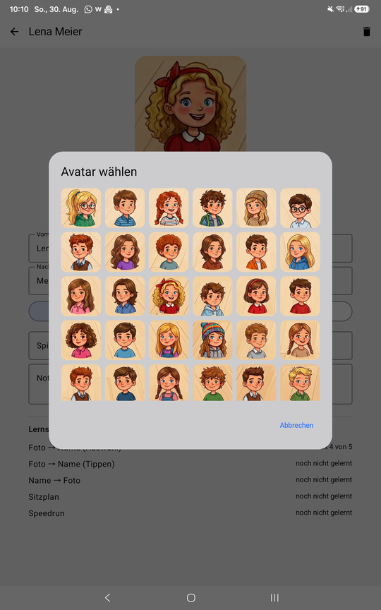
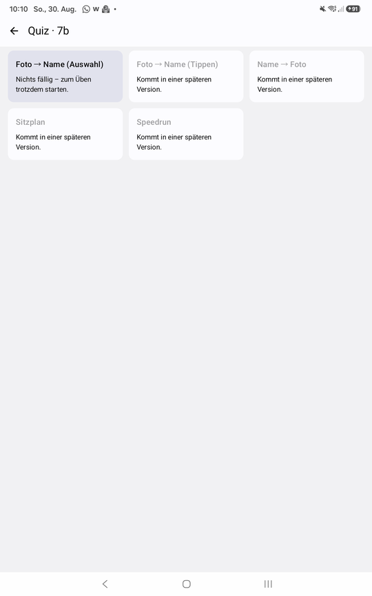
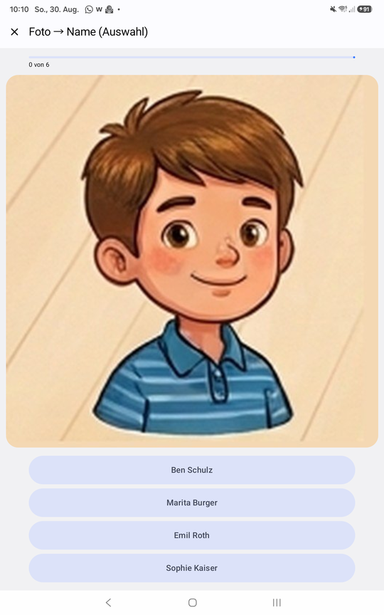
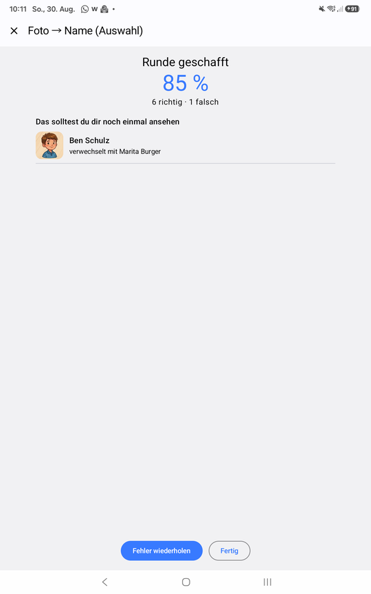
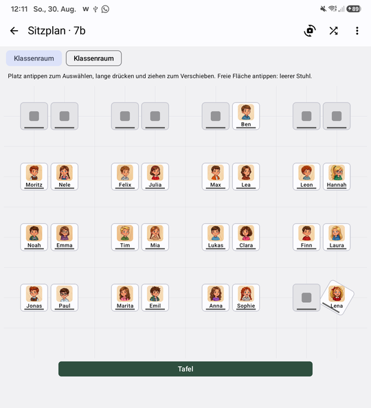
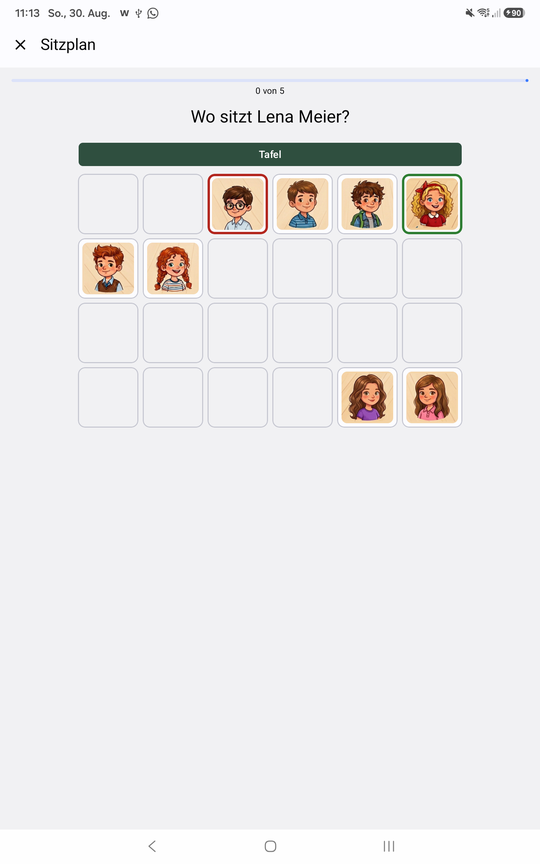

# Namio

Android-App, mit der Lehrer die Namen ihrer Schulklassen lernen.
Klassen anlegen, Fotos zuordnen, per Quiz mit Spaced Repetition üben — komplett offline.

<p align="center">
  
  
  
  
</p>
<p align="center">
  
  
  
</p>
<p align="center">
  
  
</p>

## Datenschutz zuerst

Die App verarbeitet Fotos von Minderjährigen. Deshalb gelten harte Regeln, keine Empfehlungen:

- **Kein Netzwerk.** Keine `INTERNET`-Berechtigung, keine Analytics, kein Crash-Reporting.
- **Kein Cloud-Backup.** `allowBackup="false"` und leere `dataExtractionRules`.
- **Verschlüsselte Datenbank.** Room + SQLCipher, Passphrase im Android Keystore.
- **Fotos nur im internen Speicher.** Nie in der Galerie, nie auf der SD-Karte.
- **Echtes Löschen.** Klasse weg heißt Bilddateien weg.

## Funktionen

**Klassen & Schüler**
- Klassenliste mit Lernfortschritt, Schülerraster mit Fotos
- Foto per Kamera (quadratischer Sucher mit Gesichtsrahmen), aus der Galerie oder aus 35 mitgelieferten Cartoon-Avataren
- Vorname, Nachname, Spitzname, Notiz, Geschlecht
- Demoklasse mit 24 Schülern beim ersten Start, jederzeit löschbar
- Deutsch und Englisch

**Sitzplan**
- Frei positionierbare, drehbare Plätze – schräge Doppeltische, U-Form, Gruppentische, alles was der Raum hergibt
- Vorlagen zum Start (Doppeltischreihen, U-Form, Gruppentische), Partnerplatz mit einem Tipp, Möbel wie Pult und PC als Beschriftung
- Drag & Drop oder Antippen, Einrasten am Raster, Sitzordnung mischen, mehrere Pläne pro Klasse
- Blickrichtung umschaltbar: vom Lehrerpult aus oder wie auf dem Papier

**Quiz**
- Modus *Foto → Name*: Foto oben, vier Namen zur Auswahl
- Modus *Sitzplan*: „Wo sitzt …?“ – auf den Platz tippen, trainiert die Situation im Klassenraum
- Sofortiges Feedback, Fortschrittsbalken, Ergebnis mit Fehlerliste und Wiederholungsrunde
- Ablenker werden bewusst gewählt: erst frühere Verwechslungen, dann gleicher Anfangsbuchstabe, dann Zufall — immer gleiches Geschlecht, immer aus derselben Klasse

**Lernalgorithmus**
- Leitner mit fünf Boxen und kurzen Intervallen (sofort · 10 min · 1 Tag · 3 Tage · 7 Tage)
- Falsch heißt zurück auf Box 1. Ein Lernstand pro Schüler *und* Modus.
- Falsch beantwortete Schüler kommen in derselben Runde noch einmal dran

## Geplant

- Weitere Modi: Name tippen, Name → Foto, Speedrun
- CSV-Import (Untis/Excel), Statistik
- App-Sperre per Biometrie, verschlüsselter Export

## Tech-Stack

Kotlin · Jetpack Compose (Material 3) · Hilt · Room + SQLCipher (`sqlcipher-android`) · CameraX · Coil 3 · Navigation Compose (Type-Safe) · JUnit 5

minSdk 26 · targetSdk 35 · Handy und Tablet

## Bauen

```bash
JAVA_HOME=<JDK 17 oder 21> ./gradlew :app:assembleDebug
./gradlew :app:testDebugUnitTest
```

Für Release-Builds wird eine `keystore.properties` im Projektstamm erwartet (nicht im Repo).

## Struktur

```
de.namio
├── core
│   ├── data          Room-Entities, DAOs, Datenbank, Migrationen
│   ├── lernen        Leitner, Kartenauswahl, Ablenkerwahl, Rundenlogik (reines Kotlin, getestet)
│   ├── media         FotoStore
│   ├── model         Domain-Modelle
│   ├── repository    Datenzugriff für ViewModels
│   └── security      Keystore
├── feature           klassen · schueler · quiz
└── ui                Theme, Komponenten, Navigation
```
